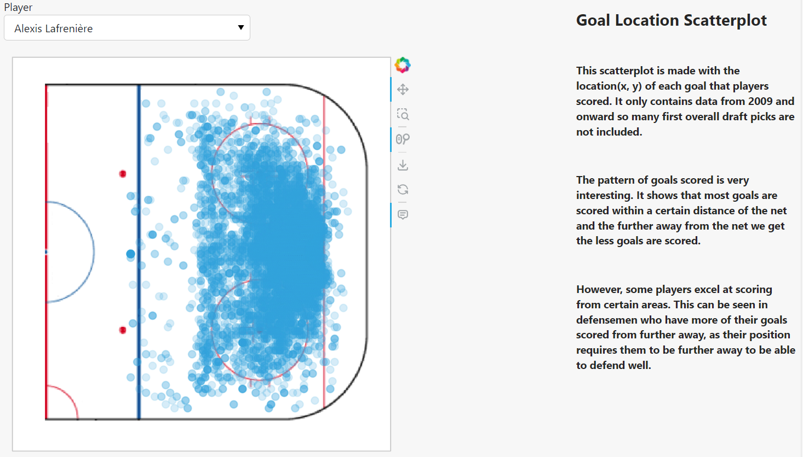

{
 "cells": [
  {
   "cell_type": "markdown",
   "metadata": {},
   "source": [
    "# NHL First Overall Draft Picks Dashboard\n",
    "\n",
    "This was a course project for DATA*6200 Data Manipulation and Visualization."
   ]
  },
  {
   "cell_type": "markdown",
   "metadata": {},
   "source": [
    "Here you can see a table of all the first overall draft picks stats throughout the years."
   ]
  },
  {
   "cell_type": "markdown",
   "metadata": {},
   "source": [
    ""
   ]
  },
  {
   "cell_type": "markdown",
   "metadata": {},
   "source": [
    "This is a scatterplot where you can select the player you want to look into and see where they scored  their goals."
   ]
  },
  {
   "cell_type": "markdown",
   "metadata": {},
   "source": [
    ""
   ]
  },
  {
   "cell_type": "markdown",
   "metadata": {},
   "source": [
    "This is a comparison between the 1st overall pick and the rest of their draft class. As you can see the graph had to be logarithmically scaled to show lines other than the 1st Overall Pick."
   ]
  },
  {
   "cell_type": "markdown",
   "metadata": {},
   "source": [
    ""
   ]
  }
 ],
 "metadata": {
  "language_info": {
   "name": "python"
  }
 },
 "nbformat": 4,
 "nbformat_minor": 2
}
